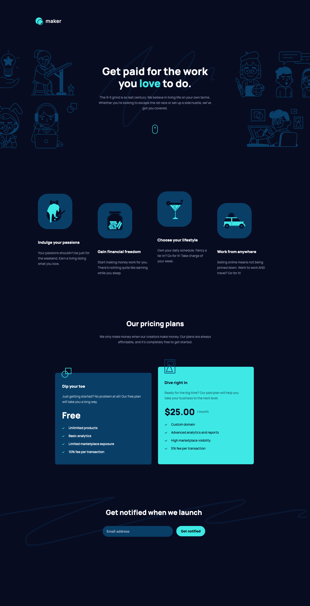

# Frontend Mentor - Maker pre-launch landing page solution

This is a solution to the [Maker pre-launch landing page challenge on Frontend Mentor](https://www.frontendmentor.io/challenges/maker-prelaunch-landing-page-WVZIJtKLd). Frontend Mentor challenges help you improve your coding skills by building realistic projects. 

## Table of contents

- [Frontend Mentor - Maker pre-launch landing page solution](#frontend-mentor---maker-pre-launch-landing-page-solution)
  - [Table of contents](#table-of-contents)
  - [Overview](#overview)
    - [The challenge](#the-challenge)
  - [Screenshot](#screenshot)
    - [Mobile View](#mobile-view)
    - [Tablet View](#tablet-view)
    - [Desktop View](#desktop-view)
    - [What I learned](#what-i-learned)
  - [Links](#links)
  - [Built with](#built-with)
    - [Useful resources](#useful-resources)
  - [Author](#author)

---

## Overview

### The challenge

Users should be able to:

- View the optimal layout depending on their device's screen size
- See hover states for interactive elements
- Receive an error message when the form is submitted if:
  - The `Email address` field is empty should show "Oops! Please add your email"
  - The email is not formatted correctly should show "Oops! That doesn’t look like an email address"

---
## Screenshot

### Mobile View


### Tablet View


### Desktop View


---

### What I learned

In this challenge, I learned about form formatting in index.html.

To see how you can add code snippets, see below:

```html
<h1>Some HTML code I'm proud of</h1>
```
```css
.proud-of-this-css {
  color: papayawhip;
}
```
```js
const proudOfThisFunc = () => {
  console.log('🎉')
}
```

If you want more help with writing markdown, we'd recommend checking out [The Markdown Guide](https://www.markdownguide.org/) to learn more.

**Note: Delete this note and the content within this section and replace with your own learnings.**


---
## Links

- Solution URL: [Github Code](https://github.com/VLOrozco/Mobile-first-Maker-pre-launch-landing-page.git)
- Live Site URL: [order-summary-component](https://vlorozco.github.io/Mobile-first-Maker-pre-launch-landing-page/)

---
## Built with

- HTML5
- CSS
- CSS Flexbox
- JavaScript Form | Email Validation
- Mobile-first workflow

---

### Useful resources

- [Example resource 1](https://www.example.com) - This helped me for XYZ reason. I really liked this pattern and will use it going forward.
- [Example resource 2](https://www.example.com) - This is an amazing article which helped me finally understand XYZ. I'd recommend it to anyone still learning this concept.

**Note: Delete this note and replace the list above with resources that helped you during the challenge. These could come in handy for anyone viewing your solution or for yourself when you look back on this project in the future.**

---
## Author

- Github - [Veronica L. Orozco](https://github.com/VLOrozco)
- Frontend Mentor - [@VLOrozco](https://www.frontendmentor.io/profile/VLOrozco)
- Codecademy - [orozcov3](https://www.codecademy.com/profiles/orozcoV3)